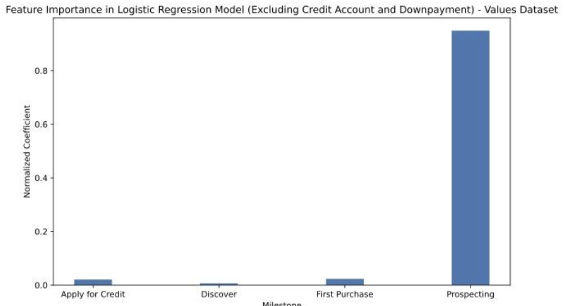

# Data Analysis of Fingerhut Website Customer Traffic Behavior from Q4 2020 to Q3 2023

## Table of Contents

- [Executive Summary](#executive-summary)
- [Acknowledgments](#acknowledgments)
  - [Team Acknowledgment](#team-acknowledgment)
  - [Data Acknowledgment](#data-acknowledgment)
- [Abstract](#abstract)
- [Introduction](#introduction)
- [Question 1](#question-1)
  - [1.1 Exploratory Data Analysis](#11-exploratory-data-analysis)
  - [1.2 Data Cleaning](#12-data-cleaning)
  - [1.3 Feature Engineering](#13-feature-engineering)
  - [1.4 Modeling](#14-modeling)
    - [1.4.1 Logistic Regression](#141-logistic-regression)
    - [1.4.2 Random Forest](#142-random-forest)
    - [1.4.3 K-Means Clustering — K-means Classifier](#143-k-means-clustering-k-means-classifier)
  - [1.5 Results](#15-results)
- [Question 2](#question-2)
  - [2.1 Exploratory Data Analysis](#21-exploratory-data-analysis)
  - [2.2 Data Engineering/Feature Engineering](#22-data-enginering-feature-engineering)
  - [2.3 Logistic Regression / Random Forest Models (Classification of Time between Steps)](#23-logistic-regression-random-forest-models-classification-of-time-between-steps)
  - [2.4 Results: Logistic Regression / Random Forest Models](#24-results-logistic-regression-random-forest-models)
  - [2.5 Results: "Binary Dataset"](#25-results-binary-dataset)
  - [2.6 Results: "Values Dataset"](#26-results-values-dataset)
- [Question 3](#question-3)
  - [3.1 Data preprocessing](#31-data-preprocessing)
  - [3.2 Average Model](#32-average-model)
  - [3.3 LSTM Model](#33-lstm-model)
  - [3.4 Prediction Results](#34-prediction-results)
- [4 Discussion](#4-discussion)
  - [4.1 Conclusion](#41-conclusion)
  - [4.2 Future Work](#42-future-work) 

## Executive Summary

  In this report, we aim to determine flaws with the current Fingerhut website design and provide feedback for possible revisions to address these issues.
  Using Fingerhut’s ideal journey for labeling customers’ journeys, we performed binary classification using Logistic Regression, Random Forest, and K-Means Clustering with Classification. From the results of all models, we observe that a revised ideal journey would include the following stages: “First Purchase,” “Prospecting,” “Downpayment,” and “Orders Shipped.” The “Apply for Credit” stage lacks the same impact as these stages, thus requiring a revision to its individual events.
  We designed four combinations of predictor variables to ultimately understand which variable(s) heavily impact the response variable “Order Shipped.” We isolated predictor variables such as “Downpayment” and “Credit Account” and used “binary” and “values” datasets, subsequently performing Logistic Regression to confirm that “Downpayment” and “Credit Account” are highly correlated with “Order Shipped.” Overall, we analyzed the feature importance of our predictors in the Logistic Regression models we implemented. We ultimately determined that a customer deviating from the ideal was more likely to have an order shipped had they prospected more frequently than other customers. Furthermore, we were able to use the timestamp variables to find hotspots in the customer interaction cycle such that Fingerhut can maximize the percentage of customers that complete their credit rehabilitation journey and graduate to the next program “Fetti” which includes a revolving line of credit.
  To enhance customer conversion rate, specifically by encouraging customers to proceed from one milestone to the next one, we focus on predicting the time for the milestones, enabling us to customize incentives such as email and promotions accordingly. Our approach suggests that the LSTM (Long Short-Term Memory) model with the time elapsed and journey_steps_until end variable for prior milestones as predictors is a viable method for forecasting the time for the next milestone. While acknowledging the limitations in model accuracy, we believe that our approach serves as a solid foundation for developing more personalized engagement strategies.

## Acknowledgments

### Team Acknowledgment

I would like to extend my gratitude to the following members who contributed to the project:
- Charles Barnes
- Han Qiang
- Zach Godick

### Data Acknowledgment

The data used in this project was provided by Fingerhut, an American catalog/online retailer.

## Abstract

  This report examines the Fingerhut dataset. It is split into three questions, with each section having its own preprocessing steps, models, and results. We compare and contrast multiple models to draw conclusions about these questions as well as discover additional insights. Through this process, we aim to evaluate the model performance based on several metrics to see how valid and applicable the model results are. We also discuss different techniques including vectorization, supervised machine learning models, unsupervised machine learning models, and statistical modeling.

## Introduction

  Using machine learning models and statistical modeling that we have learned from our data theory courses at UCLA, we hoped to guide Fingerhut in optimal journeys taken by customers and provide suggestions. In this project, we aim to explore flaws inherent in Fingerhut’s website as well as customer journeys and provide recommendations to resolve such issues.
  This larger thematic focus was split into three smaller questions to provide the most context: (1) How optimal is Fingerhut’s ideal path for customer journeys? (2) How can we maximize a customer achieving the “Order shipped” milestone using their interaction with intermediate steps? (3) How can we maximize the customer conversion rate by predicting customer behaviors?
  We began with two .csv files: export.csv (the main Fingerhut dataset) and Event Definitions.csv. In export.csv, there are 64,911,906 entries for customers described by 7 columns: customer_id (the customer ID), account_id (the account ID), ed_id (the event ID), event_name (name of the event), event_timestamp (when the event occurred), and journey_steps_until_end (an integer count of which journey step the customer is on).


**Figure 0: Fingerhut Dataset**

## <u>**Question 1**</u>

### 1.1 Exploratory Data Analysis

  Prior to data cleaning, we performed an initial analysis of the data to investigate our question in greater detail. There are a total of 7 named stages in addition to an unknown stage(s) for two events regarding promotions (event ID 1) and email clicks (event ID 24). The stages are as follows in no particular order: “Apply for Credit,” “Credit Account,” “Discover,” “Downpayment,” “First Purchase,” “Order Shipped,” “Prospecting,” and an 8th stage we will refer to as “Miscellaneous.”
  In Figure 1(a), we observe how many customers go through each of the stages over time, with the highest activity being “First Purchase” and the lowest activity being “Downpayment.” Observing how much activity occurs stage by stage can provide us insight into which stages are being ignored and require the most assistance.
  In Figure 1(b), we see a small sample of customers’ journeys and how they compare to each other. It seems that “First Purchase” yields the longest journey length whereas customers would change from stage to stage very frequently.
  In Figure 1(c), a heat matrix shows how closely similar these paths are to each other. We see that there are a few identical paths between different customers and a decent amount of paths with at least around 75% similarity. This suggests that a certain journey is preferable by multiple customers, which could help us confirm the validity of Fingerhut’s ideal path or provide a revision so that the Fingerhut website can yield more customers.


**Figure 1(a-c): Exploratory Data Analysis**

### 1.2 Data Cleaning

  To clean the data, we first performed a left merge of the main dataset and the event definitions dataset on the event IDs to have each entry represented with a stage. We noticed that rows containing event IDs 1 and 24 (those being “promotion_created” and “campaignemail_clicked” respectively) had no associated stage; as a fix, we assigned them an arbitrary stage called “misc.” Since this question primarily focuses on stages and events, we only kept the following columns: the customer ID, the event ID (since event name and ID were semantically identical while the latter is visually easier to identify), and the journey_steps_until_end variable. One crucial assumption we made in the next step was to assume that a new journey for a customer restarted when the journey_steps_until_end reset to 1. We first cataloged the number of journeys taken for each customer, as indicated by a reset in the journey_steps_until_end variable, then combined all the event IDs and stages into their own lists for each journey per customer.


**Table 1: Customers with Labeled Multiple Journeys, and Stage and Path as Lists**

Performing EDA on our modified dataset provides a few insights:
  (1) The majority of customers stayed within the “First Purchase” stage, followed by “Apply for Credit” stage, while other stages saw diminished participation in other stages. Even if we take into account that some stages have more associated events than others (e.g. 8 events within “Apply for Credit” versus 5 events within “Discovery”), there appears to be a significant discrepancy in the ratio between the earlier stages (“Apply for Credit” and “First Purchase”) and the terminating stages (especially “Order Shipped”).
  (2) We see that the first journey had outliers with the longest journey lengths; surprisingly, the second journey also had outliers with long journey lengths. Otherwise, the boxplots indicate that the journey lengths were relatively on par according to the IQR of each plot. Note in the top-right figure that some journeys were labeled as the “0th” journey, indicating that our metric is flawed; however, the majority of journeys lie within the 1st journey.
  (3) The majority of journeys have lengths of less than approximately 250 steps. See the summary statistics for a more discrete observation of journey lengths.
  (4) Multiple journeys are rather uncommon; the majority of customers only did one journey, a few had a second journey, and a very tiny minority ever did more than three journeys total.


**Figure 2: EDA on Multiple Journeys**


**Table 2: Summary Statistics of Multiple Journeys**

### 1.3 Feature Engineering

After cleaning the data, we begin with labeling stages in accordance with how “ideal” they were. In the case of testing how customers progress through stages, we used a metric of comparing a customer’s entire journey in stages to Fingerhut’s ideal stage route: (1) Apply for Credit (2) First Purchase (3) Down Payment (4) Order Shipped. A score is assigned to how many of these stages are reached in that specific order, then labeled with a 1 for “ideal” only if all four stages happen to be present within the customer’s stages.


**Figure 3: Imbalanced Dataset for Ideal and Non-Ideal Paths**

  Our initial labeling shows that the dataset is imbalanced with 317,592 ideal paths and 1,501,408 non-ideal paths (for a total of 1,819,000 labels), requiring us to balance the dataset. Based on our binary labeling of the paths, we see that roughly 21.15% of total journeys were considered ideal.
  Due to hardware constraints (i.e. the kernel continued to crash with memory-intensive actions), we were unable to balance the dataset in its rawest form with the labels without pre-processing. However, implementing pre-processing enables us to use techniques such as oversampling to balance out the dataset without encountering issues. We first converted the list of stages into a string version of the entire list, then applied a vectorizer (CountVectorizer) to turn these lists into numerical vectors that can be inputted into our models. The result is twelve different features representing the different stages. The table below shows each stage and its corresponding features:


**Table 3: Stages and Features**

After performing an 80/20 train-test split of the dataset, we proceeded to apply oversampling on the training data for the minority class (in this case, “Ideal” or 1’s).
Given how high-dimensional the data is, we employed Principal Component Analysis (PCA) as our dimension reduction technique for specific models to reduce the high-dimensional features down to lower-dimensional features, which helped accelerate and bolster model performance.

### 1.4 Modeling

For best predicting ideal paths, we used three different models and evaluated their performance.

#### 1.4.1 Logistic Regression

Logistic Regression is a common supervised classification technique that can be applied to the scoring system we used for labeling ideal journeys. However, fitting the labels without further modification leads to this technique performing too well [1]. To counter the issue of overfitting, we applied L2 regularization as well as hyperparameter tuning, specifically for the inverse of regularization strength C; decreasing C will increase the regularization strength of the model. Hyperparameter tuning for the optimal C value produced C = 10. The results are shown below in Figure 4 and Table 4:


**Figure 4: ROC Curve for Logistic Regression (C = 10)**


**Table 4: Performance Metrics for Logistic Regression (L: Baseline, R: Best)**

#### 1.4.2 Random Forest

  Random Forest is made up of an ensemble of decision trees which all contribute to the final prediction. Examining the different decision paths for the features can provide insight into how the model predicts the ideal path, whether it be the ordering, length, or both regarding the list of stages.
  The Random Forest model is also able to assess the importance of different features from our pre-processed data in relation to the stages. We see that Features 1, 5, 9, and 12 have the highest values, which suggests that “Apply for Credit”, “First Purchase”, “Down Payment”, and “Order Shipped” are correlated when it comes to the ideal path; it seems that “First Purchase” and “Down Payment” yield the greatest importance.
  Pruning controls complexity and prevents overfitting by restricting the model’s ability to memorize training data. However, it appears that pruning does not have the largest effect on model performance.


**Figure 5: Random Forest Decision Tree Model**


**Table 5: Feature Importances**


**Table 6: Model Performance for Random Forest**

#### 1.4.3 K-Means Clustering — K-means Classifier

  In this approach, we will combine an unsupervised model with a supervised model. K-means clustering will contribute to greater dimensionality reduction and help improve model performance in the classification task. We will also use a metric called the silhouette score to evaluate the quality of the clusters produced by K-means, which measures how similar objects are to their own clusters (cohesion) versus other clusters (separation). Scores with magnitude closer to 1 indicate proper matching to clusters. In addition, we will use PCA to further reduce dimensionality [2].
  We will first apply K-means clustering without using dimension reduction on the techniques for our baseline model. Using an arbitrary choice of two clusters and fitting the K-means model onto our training data to produce cluster labels, we then train our Logistic Regression model onto our labels. We collect an accuracy score from our combined model, then obtain the silhouette score of the model based on the training data.
  For our best model, we find the cumulative explained variance ratio to determine the number of PCA components to use; 2 components explain at least 95% variance, which will be the optimal number of PCA components we use. We then apply the elbow method to determine the optimal number of K Clusters to use; past 3 clusters is when the graph begins to plateau, meaning the optimal number of K-clusters we use is 3. We proceed to scale the training and testing data for our inputs, apply PCA onto our inputs, and repeat the same steps as the baseline model; a grid search for hyperparameter-tuning for Logistic Regression shows that C = 10 is the most optimal. The following results are summarized by the figures and tables below:


**Figure 6: Determining the Optimal Number of PCA components and K-Clusters for Model**


**Figure 7: PCA Components for All Features**


**Figure 8: Classification Reports and Confusion Matrices for K-Means Cluster Model (L: Baseline, R: Best)**


**Figure 9: ROC Curve for K-Means Clustering with Logistic Regression Classifier (Before and After Optimization)**


**Table 7: Model Performance for K-Means Clustering with Logistic Regression Classifier**


**Figure 10: Visualization of 3 K-Means Clusters with 2 Principal Components**

#### 1.5 Results
 
  We observe that the supervised learning models performed too well (with approximately 100% accuracy), indicating that the data is too imbalanced, either due to noise or other inherent issues with the data, despite using optimization techniques to account for this issue, leading to biased model results; most of the improvements did not have a discernible effect on the model performance compared to the baseline.   However, the Random Forest model’s insights into feature importance, in particular how “First Purchase” and “Down Payment” are significant in a customer journey being classified as “Ideal.”
However, unsupervised learning models seem to perform more appropriately at the cost of lower accuracy. Combining an unsupervised model with a supervised model provided the best result; in the case of K-means clustering with the Logistic Regression classifier, a significant increase in the testing accuracy at the slight expense of the silhouette score suggests that objects were mostly successful in matching to the correct clusters. The clustering shape appears triangular, which may suggest uneven density and an underlying complexity that is not fully captured; however, model performance seems to be sufficient enough to have results be interpretable.
  Of most importance from our combined model are the resulting PCA components. For the 1st component, the following stages showed the greatest variations: “Apply for Credit,” “First Purchase,” “Downpayment,” and “Order Shipped;” for the 2nd component, the following stages showed the greatest variance: “Apply for Credit,” and “Prospecting”. In addition to the stages listed as being “Ideal” by Fingerhut, surprisingly the “Prospecting” stage has a significant effect when it comes to customer journeys. This may suggest that a more ideal stage would include “Prospecting” as one of the stages.

## <u>**Question 2**</u>

### 2.1 Exploratory Data Analysis

Through our analysis of the dataset, we also decided to focus on whether the time between intermediate milestone achievements such as (variable name: place_downpayment) and credit account activation (variable name: account_activitation which was unfortunately misspelled in the provided dataset) had any effect on the rate at which a customer completed their journey by having their order shipped. We did so by measuring the time between Stage 1 and Stage 3 of the milestones provided by Fingerhut — account application in “Apply for Credit” and account activation in “Credit Account” — and running them through several models to see if there was a significant difference between them and baseline predictors of whether the duration of time between stages would predict if the customer eventually completed their journey by having an order shipped.


**Figure 11(a-c): Respective Counts for Each Milestone for 2021, 2022, and 2023 by Week Number**


**Figure 12(a-c): Respective Proportions of Various Milestones Relative to “Order Shipped” for 2021, 2022, and 2023 by Week Number**


**Figure 13(a-b): Number of Accounts that Reached “Downpayment,” “Activated Credit,” and “Order Shipped”**


**Figure 14(a-c): Number of Accounts that Reached “Downpayment,” “Activated Credit,” and “Order Shipped” Over 2021-2023 by Month**

  From Figure 11(a-c), we see that week over week, “First Purchase” is by far the most common stage, followed by the “Apply for Credit” stage. In addition, there is a dip in activity across stages in weeks 31-37, from late July to late September. We then see an uptick in activity across stages in weeks 47-51, corresponding with the holiday season. Holistically, these graphs show customer behavior in a given year and allow us to predict how many unique customers will reach certain milestones in a given year.
  From Figure 12(a-c), we see the respective ratios of various milestones relative to “Order Shipped” in a given year. Generally, in ascending order of milestones relative to “Order Shipped”: “First Purchase,” “Apply for Credit,” “Discover,” “Downpayment,” and “Credit Account.” Generally, these proportions do not change significantly week over week in a given year. This graph provides a sense of how “Order Shipped” varies with the various milestones in the dataset, specifically that it correlates most with “Downpayment” and “Credit Account.”
  From Figure 13(a-b), we see a relatively strong association between “Downpayment,” activated credit with “Credit Account,” and “Order Shipped.” In both cases, fewer accounts successfully shipped their orders than those that paid their downpayment or activated their credit, but there seems to be a stronger association between downpayment and order shipment among the variables.
  From Figure 14(a-c), we see month over month the number of accounts that hit the downpayment, activated credit, and order shipped milestones. Among these variables, there is a downward trend during the summer months and an uptick during the holiday season.
  Performing exploratory data analysis allowed us to further understand the dataset and generalize important steps customers take in a given year. We were able to look further at unique customer paths to make generalizations after visualizing holistic customer journey paths and quantifying milestones that customers in the dataset reached. Furthermore, we were able to understand that “Downpayment” and “Credit Account” were highly correlated with “Order Shipped.”

### 2.2 Data Engineering/Feature Engineering

  Overall, we decided to focus on the time between stages to try and use this data to predict whether a customer completed their journey. A few ideas that we had for creating new binary variables were based on a journey step taking longer or shorter than a specified length of time. To create these new variables, we implemented our data manipulation techniques of filtering, table pivoting, merges, datatype conversions, NA value removal, and many others and applied them to the dataset to create our new variables. Once we divided the dataset into groups based on unique customer ID and account ID, we removed journeys that were too short (e.g. 1 step long) and filtered the journeys to the ones that included the milestones that we were considering. Furthermore, we assumed that any journey that had longer than 60 days between steps was incomplete. Finally, we created our new variables and added them to our final data frames before removing invalid journeys and missing data.
  In a related attempt, we considered order_shipped as the response variable and considered the variables corresponding to milestones “Apply for Credit,” “Credit “Account,” “Discover,” “Downpayment,” “First Purchase,” and “Prospecting” as predictor variables. In this analysis, we looked at 2021 data, only, to understand which variables influence the response variable order shipped. Firstly, there were two datasets that we worked with - one dataset labeled “binary dataset” and the other dataset labeled “values dataset.” The binary dataset considered unique customer IDs from 2021 and determined with 0/1s whether the milestones “Apply for Credit,” “Credit “Account,” “Discover,” “Downpayment,” “First Purchase,” and “Prospecting” had occurred. The “values dataset” considered unique customer IDs from 2021 and determined the number of occurrences of the same milestones.

### 2.3 Logistic Regression / Random Forest Models (Classification of Time between Steps)

  Once we created the integer and binary variables, we trained a couple of models to classify the customer journeys as successful or unsuccessful based on whether the order was indeed shipped. With so few variables that could be used in each model, we focused on the Logistic Regression Classifier and tree-based models such as the Random Forest Model to classify whether a journey was completed or not. We also created a baseline success model directly from the split between successful and unsuccessful journeys to measure the added value of the models and quantify their relative performance.

### 2.4 Results: Logistic Regression / Random Forest Models


**Figure 15: A frequency chart of the time between Account Activation and Application Approval**


**Table 8: Classification Report for Random Forest Model**


**Table 9: Accuracy of different models**

  The Random Forest model in particular overtrained to such an extent that over 99% of the journeys were classified as reaching completion by being characterized as having shipped an order. In reality, only 76% of these journeys in this particular dataset were completed which made the recall score a perfect 100% for the completed journeys while only scoring at 2% for incomplete journeys. Even with a rebalanced dataset, the graph of time between these stages shows a similar trend of exponential decay at a scale that reflects the different sizes of population groups within the data so we were unable to glean much meaningful information from this aspect of our analysis. These methods ultimately turned out to be unsuccessful as the models showed little to no improvement over a baseline assumption.

### 2.5 Results: “Binary Dataset”

  To determine the relationship between the predictor variables, we used a correlation matrix. In Figure 17, we see that the variables corresponding to the stages “Credit Account” and “Downpayment” are highly correlated. Furthermore, “Credit Account” and “Prospecting” in addition to “Downpayment” and “Prospecting” are moderately correlated. Then, we considered 4 different combinations of predictor variables and ran Logistic Regression models. These 4 combinations include all predictors, all predictors excluding “Downpayment,” all predictors excluding “Credit Account,” and all predictors excluding “Downpayment” and “Credit Account.” By isolating the variables “Downpayment” and “Credit Account,” which had a relatively high feature importance, as seen in Figure 18, and were highly correlated with each other, as seen in Figure 17, we could better understand which milestones influenced the shipment of orders. Below are Figures 18-21 and Tables 9-12, the barplots for these 4 combinations, and their accompanying classification reports and confusion matrices.


**Figure 17: Correlation Matrix of Predictor Variables - Binary Dataset**


**Figure 18: Barplot of Feature Importance in Logistic Regression Model for All Predictors - Binary Dataset**


**Table 10: Classification Report and Confusion Matrix for All Predictors - Binary Dataset**


**Figure 19: Barplot of Feature Importance in Logistic Regression Model for All Predictors Excluding Downpayment - Binary Dataset**


**Table 11: Classification Report and Confusion Matrix for All Predictors Excluding Downpayment - Binary Dataset**


**Figure 20: Barplot of Feature Importance in Logistic Regression Model for All Predictors Excluding Credit Account - Binary Dataset**


**Table 12: Classification Report and Confusion Matrix for All Predictors Excluding Credit Account - Binary Dataset**


**Figure 21: Barplot of Feature Importance in Logistic Regression Model for All Predictors Excluding Credit Account and Downpayment - Binary Dataset**


**Table 13: Classification Report and Confusion Matrix for All Predictors Excluding Credit Account and Downpayment - Binary Dataset**

  Based on Figure 18, we see that “Downpayment” has the highest feature importance in the Logistic Regression model that included all predictor variables, followed by the “Apply for Credit” stage. This model was supported by 98% accuracy in addition to 98% weighted average precision, recall, and F-1 score.
  Based on Figure 19, we see that when excluding “Downpayment,” “Credit Account” has the highest feature importance, followed by “Apply for Credit.” This model was supported by 95% accuracy in addition to 96% weighted average precision, 95% weighted average recall, and 95% weighted F-1 score.
  Based on Figure 20, we see that when excluding “Credit Account,” “Downpayment” has the highest feature importance, followed by “Apply for Credit.” This model was supported by 98% accuracy in addition to 98% weighted average precision, recall, and F-1 score. Interestingly, the predictors in this model (“Apply for Credit,” “Discover,” “Downpayment,” “First Purchase,” and “Prospecting”) performed similarly to how they performed in the model when all predictors were included.
  Based on Figure 21, we see that when excluding “Downpayment” and “Credit Account,” “First Purchase” has the highest feature importance. This model was supported by 80% accuracy, 63% weighted average precision, 80% weighted average recall, and 70% percent weighted average F-1 score. This model had by far the lowest accuracy, precision, recall, and F-1 score among the four combinations of variables considered.
  Our findings from these four models suggest that “Downpayment” and “Credit Account” were the most influential milestones in predicting if an order is shipped. Furthermore, when we excluded the milestones “Downpayment” and “Credit Account,” the milestone “First Purchase” was the most indicative of whether an order is shipped, but this model had the lowest accuracy, precision, recall, and F-1 score.

### 2.6 Results: “Values Dataset”

  In Figure 22, similar to the binary dataset, we see that the stages “Credit Account” and “Downpayment” are highly correlated. Furthermore, “Credit Account” and “Prospecting” in addition to “Downpayment” and “Prospecting” are moderately correlated. Then, we considered 4 different combinations of predictor variables and ran Logistic Regression models (the same combinations used for the binary dataset). Below are Figures 23-26 and Tables 13-16, the barplots for these 4 combinations and their accompanying classification reports and confusion matrices.


**Figure 22: Correlation Matrix of Predictor Variables - Values Dataset**


**Figure 23: Barplot of Feature Importance in Logistic Regression Model for All Predictors - Values Dataset**


**Table 14: Classification Report and Confusion Matrix for All Predictors - Values Dataset**


**Figure 24: Barplot of Feature Importance in Logistic Regression Model for All Predictors Excluding Downpayment - Values Dataset**


**Table 15: Classification Report and Confusion Matrix for All Predictors Excluding Downpayment - Values Dataset**


**Figure 25: Barplot of Feature Importance in Logistic Regression Model for All Predictors Excluding Credit Account - Values Dataset**


**Table 16: Classification Report and Confusion Matrix for All Predictors Excluding Credit Account - Values Dataset**



**Figure 26: Barplot of Feature Importance in Logistic Regression Model for All Predictors Excluding Credit Account and Downpayment - Values Dataset**


**Table 17: Classification Report and Confusion Matrix for All Predictors Excluding Credit Account and Downpayment - Values Dataset**

  Based on Figure 23, we see that “Credit Account” has the highest feature importance in the Logistic Regression model that included all predictor variables, followed by “Downpayment.” This model was supported by 98% accuracy in addition to 98% weighted average precision, recall, and F-1 score.
  Based on Figure 24, we see that when excluding “Downpayment,” “Credit Account” has by far the highest feature importance. This model was supported by 95% accuracy in addition to 96% weighted average precision, 95% weighted average recall, and 95% weighted F-1 score.
  Based on Figure 25, we see that when excluding “Credit Account,” downpayment has the highest feature importance, followed by prospecting. This model was supported by 98% accuracy in addition to 98% weighted average precision, recall, and F-1 score.
  Based on Figure 26, we see that when excluding “Downpayment” and “Credit Account,” prospecting has the highest feature importance. This model was supported by 81% accuracy, 78% weighted average precision, 81% weighted average recall, and 77% percent weighted average F-1 score. This model had by far the lowest accuracy, precision, recall, and F-1 score among the four combinations of variables considered.
  Similar to the binary dataset, our findings from these four models suggest that “Downpayment” and “Credit Account” were the most influential milestones in predicting orders shipped. Furthermore, when we excluded the milestones “Downpayment” and “Credit Account,” the milestone “Prospecting” was the most indicative of orders being shipped, but this model had the lowest accuracy, precision, recall, and F-1 score. This contrasts our findings from the binary dataset, which suggested that first purchase was most influential when excluding “Credit Account” and “Downpayment.” The “values dataset” suggests that the more frequently a customer interacts with the catalog, the more likely the customer will have an order shipped. Thus, more interaction from customers with the Fingerhut website and encouraging customers to complete their orders correlate with orders being shipped.

## <u>**Question 3**</u>

  To enhance the customer conversion rates to reach the order_shipped milestone, we aim to predict the time elapsed until the next milestone to customize the incentives like emails, text messages, and promotions.

### 3.1 Data preprocessing

  We first extracted the specific ed_ids that correspond to the milestones. For milestone 1, we selected events with ed_id 12 and 15; for milestone 2, we selected events with ed_id 18 and 7; for milestone 3, we selected ed_id 29; for milestone 4, we selected ed_id 8 and 23 and ed_id 27 for milestone 5. Since we only focus on prediction for web milestones, we exclude the milestones that are completed via phone from our analysis, which are events with ed_id 15, 18, and 25. Following the event ID selection, we proceeded by calculating the elapsed time, which is the duration of time between the current milestone event and the previous milestone event, and created the time_elapsed variable. For the first milestone, where there is no preceding milestone, we fill the time_elapsed variable with 0. The next step involves refining the data for modeling by addressing the potential outliers. We define an outlier as any time_elapsed value that deviates significantly from the mean of that milestone. In addition, we apply log transformation to the time_elapsed variable.

### 3.2 Average Model

  The average model serves as our baseline. It predicts the time elapsed for the next milestone by calculating the average time for prior milestones of all training customers. This model assumes uniform behavior across all customers, providing a generalized prediction. It sets a benchmark for the performance of more sophisticated models, allowing us to measure the more advanced models.

### 3.3 LSTM Model

  The LSTM (Long Short-Term Memory) model represents a more advanced approach. It utilizes the capability of neural networks to predict customer behaviors over time. This model considers each customer’s journey, including the time elapsed and journey steps taken to reach the prior milestones. The LSTM model offers a prediction for when a customer is likely to achieve the next milestone, facilitating the delivery of relevant incentives.

### 3.4 Prediction Results

  We have constructed our predictive models specifically for milestones 3, 4, and 5 to take into account the customer behaviors at different stages. Notably, we have not developed a model for milestones 1, 2, and 6. Milestone 1 lacks a preceding milestone, making it impossible for us to build a model. Milestone 2 presents a case where we only observe one preceding time_elapsed value. The lack of multiple observations means there may be minimal variability in prediction, leading to predictions that may not be ideal. As for milestone 6, which corresponds to the event order_shipped, the milestone’s occurrence depends on the company’s logistical operation rather than customer behaviors. Consequently, analyzing milestone 6 doesn’t contribute to our goal of predicting customer behaviors.


**Figure 27: Plot for Actual vs Predicted Time For Milestone 3**


**Figure 28 (L): Plot for Actual vs Predicted Time For Milestone 4**


**Figure 29 (R): Plot for Actual vs Predicted Time For Milestone 5**

  Figure 28 has the same context as the preceding figure. It provides a comparison of predicted versus actual time elapsed for milestone 4 with two different models. The LSTM model clearly captures the variability of the actual time to some degree. It suggests the superiority of the LSTM model over the average model in this context. The MSE for the LSTM model is 5.71, while the MSE for the average model is 18.44.
  Figure 29 provides a comparison of predicted versus actual time elapsed for milestone 5 with two different models and shares the same context with previous figures. It suggests the LSTM model predicts the fluctuations in accordance with the actual values, while the average model provides a uniform prediction across accounts. The MSE for the LSTM model is 0.607 and the MSE for the average model is 32.87. Based on the models, we can observe that the model for milestone 5 exhibits the lowest test loss, implying that it has the highest accuracy out of the three models. This may contribute to the fact that it has the most time_elapsed and journey_steps_until_end values for predictions.
  The LSTM model with time_elapsed and journey_steps_until_end exhibits the smallest MSE loss. The result underscores the significant predictive accuracy of the LSTM model over the average model. By more accurately predicting customer behaviors using the LSTM model, Fingerhut can tailor their strategies to enhance customer experiences and customer conversion rates through personalized marketing campaigns. This could involve tailored email campaigns and recommendations to engage customers at the right time.

## 4 Discussion

### 4.1 Conclusion

  Based on the aggregated results of our models for binary classification on ideal journeys, we saw that the stages “First Purchase,” “Downpayment,” and “Orders Shipped” were the greatest contributing factors for a path to be considered ideal, with “Apply for Credit” seemingly holding less significance compared to those two. The “Prospecting” stage may also be important considering the magnitude of variance it had on the PCA components. These findings suggest that the ideal path should either find more support, specifically in leveraging the “Apply for Credit” stage better (e.g. more or fewer events within this stage) or the ideal path should be revised to include “First Purchase,” “Downpayment,” “Orders Shipped,” and “Prospecting.” The frontend design of the website could have played a role in dictating where customers would click to interact with the website, which may determine how a journey pans out; in other words, the design of the website could be informative as to how well a customer can navigate through the website. However, such information is difficult to quantify and therefore only speculation at best.
  The importance of Statistical Privacy and the safety of both user information and proprietary Fingerhut information severely limited the scope of the dataset that we were able to work on. We were, however, able to use the event_timestamp variable to find hotspots in the customer interaction cycle such that Fingerhut can maximize the percentage of customers that complete their credit rehabilitation journey and graduate to the next program “Fetti” which includes a revolving line of credit. In addition, our Logistic Regression models suggest that “Downpayment” and “Credit Account” are highly correlated with “Order Shipped,” which was confirmed in the visualizations from our EDA. Furthermore, when considering whether certain milestones had been achieved (binary), and excluding “Downpayment” and “Credit Account,” “First Purchase” had the highest feature importance in the Logistic Regression model for “Order Shipped.” In contrast, when considering occurrences of various milestones (values), and excluding “Downpayment” and “Credit Account,” “Prospecting” had the highest feature importance in the Logistic Regression model for “Order Shipped.” Ultimately, a customer deviating from the ideal was more likely to have an order shipped had they prospected more frequently than other customers.
  Our approach suggests that the LSTM model is a viable method for predicting the time until the next milestone, potentially aiding in enhancing the customer conversion rate. We suggest that Fingerhut consider adopting the approach or other methods to study customer behaviors while addressing the limitations concerning model accuracy and the handling of extreme cases.

### 4.2 Future Work

  In consideration of how ideal a journey path can be classified, we can look into training other predictive models such as RNN (LSTM) and CNN, which would be trained in classifying a journey as being ideal. We could also look into expanding into multi-class classification of ideal journey paths, specifically degrees of ideal (e.g. half-ideal, less than ideal, close to ideal). It is worth noting that the complexity and structure of the data made it difficult or close to impossible to capture all the details accurately, so a future class could look into finding alternative models that can handle the data’s intricacies better.
  When maximizing the order shipped variable, it is important to consider that the dataset worked with was imbalanced and only considered data from the year 2021 due to computational costs. In future studies, to gain a better understanding of the order_shipped variable, we could address this data imbalance, add predictors such as page views, time intervals, and mobile data, and consider data through 2024. Additionally, the time interval between specific stages method that we pursued is not an easy one to analyze using classification models because of the high variability and overlap in customer behavior on a website regardless of whether a journey is completed or not. Unfortunately, without more information to supplement this method, we found it difficult to continue down this path and would potentially require more information that could compromise either user privacy or company privacy, thus making it inaccessible to us as outside consultants.
  For the prediction of time for the next milestone, we randomly selected a subset of 1000 customer account IDs for training and testing purposes due to computational concerns. In the future, we could expand our analysis beyond the 1000 accounts to improve model robustness. Additionally, we aim to consider hyperparameter tuning to fine-tune our models to further enhance prediction accuracy, provided we have more computing power.

## Project Structure

```plaintext
FingerhutWebsite/
|
├── code/                                # Folder containing all code related files
|   ├── CONTAINER (FINAL).ipynb          # PDF of Python code focused on EDA and model building in the delivery ward
|   └── CONTAINER (FINAL).pdf            # PDF of Python code
|
├── data/                                # Folder containing all data related files
|   ├── Event Definitions.csv            # Definitions of the website events and actions
|   └── verysmall.csv                    # small sample of the dataset containing customer data on Fingerhut website
|
├── figures/                             # Folder containing all relevant figures of EDA and model results
|   ├── Fig0.png                         # Fingerhut Dataset
|   ├── Fig1a.png                        # Exploratory Data Analysis
|   ├── Fig1b.png                        # Exploratory Data Analysis
|   ├── Fig1c.png                        # Exploratory Data Analysis
|   ├── Fig2.png                         # EDA on Multiple Journeys
|   ├── Fig3.png                         # Imbalanced Dataset for Ideal and Non-Ideal Paths
|   ├── Fig4.png                         # ROC Curve for Logistic Regression (C = 10)
|   ├── Fig5.png                         # Random Forest Decision Tree Model
|   ├── Fig6.png                         # Determining the Optimal Number of PCA components and K-Clusters for Model
|   ├── Fig7.png                         # PCA Components for All Features
|   ├── Fig8.png                         # Classification Reports and Confusion Matrices for K-Means Cluster Model (L: Baseline, R: Best)
|   ├── Fig9.png                         # ROC Curve for K-Means Clustering with Logistic Regression Classifier (Before and After Optimization)
|   ├── Fig10.png                        # Visualization of 3 K-Means Clusters with 2 Principal Components
|   ├── Fig11.png                        # Respective Counts for Each Milestone for 2021, 2022, and 2023 by Week Number
|   ├── Fig12.png                        #  Respective Proportions of Various Milestones Relative to “Order Shipped” for 2021, 2022, and 2023 by Week Number
|   ├── Fig13.png                        # Number of Accounts that Reached “Downpayment,” “Activated Credit,” and “Order Shipped”
|   ├── Fig14.png                        #  Number of Accounts that Reached “Downpayment,” “Activated Credit,” and “Order Shipped” Over 2021-2023 by Month
|   ├── Fig15.png                        # A frequency chart of the time between Account Activation and Application Approval
|   ├── Fig17.png                        # Correlation Matrix of Predictor Variables - Binary Dataset
|   ├── Fig18.png                        # Barplot of Feature Importance in Logistic Regression Model for All Predictors - Binary Dataset
|   ├── Fig19.png                        # Barplot of Feature Importance in Logistic Regression Model for All Predictors Excluding Downpayment - Binary Dataset
|   ├── Fig20.png                        # Barplot of Feature Importance in Logistic Regression Model for All Predictors Excluding Credit Account - Binary Dataset
|   ├── Fig21.png                        # Barplot of Feature Importance in Logistic Regression Model for All Predictors Excluding Credit Account and Downpayment - Binary Dataset
|   ├── Fig22.png                        #
|   ├── Fig23.png                        # Barplot of Feature Importance in Logistic Regression Model for All Predictors - Values Dataset
|   ├── Fig24.png                        # Barplot of Feature Importance in Logistic Regression Model for All Predictors Excluding Downpayment - Values Dataset
|   ├── Fig25.png                        # Barplot of Feature Importance in Logistic Regression Model for All Predictors Excluding Credit Account - Values Dataset
|   ├── Fig26.png                        #  Barplot of Feature Importance in Logistic Regression Model for All Predictors Excluding Credit Account and Downpayment - Values Dataset
|   ├── Fig27.png                        # plot for Actual vs Predicted Time For Milestone 3
|   ├── Fig28.png                        # (L): plot for Actual vs Predicted Time For Milestone 4
|   └── Fig29.png                        # (R): plot for Actual vs Predicted Time For Milestone 5
|
├── tables/                              # Folder containing all relevant tables of EDA and model results
|   ├── Table1.png                       # Customers with Labeled Multiple Journeys, and Stage and Path as Lists            
|   ├── Table2.png                       # Summary Statistics of Multiple Journeys
|   ├── Table3.png                       # Stages and Features
|   ├── Table4.png                       # Performance Metrics for Logistic Regression (L: Baseline, R: Best)
|   ├── Table5.png                       # Feature Importances
|   ├── Table6.png                       # Model Performance for Random Forest
|   ├── Table7.png                       # Model Performance for K-Means Clustering with Logistic Regression Classifier
|   ├── Table8.png                       # Classification Report for Random Forest Model
|   ├── Table9.png                       # Accuracy of different models
|   ├── Table10.png                      # Classification Report and Confusion Matrix for All Predictors - Binary Dataset
|   ├── Table11.png                      # Classification Report and Confusion Matrix for All Predictors Excluding Downpayment - Binary Dataset
|   ├── Table12.png                      # Classification Report and Confusion Matrix for All Predictors Excluding Credit Account - Binary Dataset
|   ├── Table13.png                      # Classification Report and Confusion Matrix for All Predictors Excluding Credit Account and Downpayment - Binary Dataset
|   ├── Table14.png                      # Classification Report and Confusion Matrix for All Predictors - Values Dataset
|   ├── Table15.png                      # Classification Report and Confusion Matrix for All Predictors Excluding Downpayment - Values Dataset
|   ├── Table16.png                      #  Classification Report and Confusion Matrix for All Predictors Excluding Credit Account - Values Dataset
|   └── Table17.png                      # Classification Report and Confusion Matrix for All Predictors Excluding Credit Account and Downpayment - Values Dataset
|
|   
├── README.md                            # Project documentation
└── SLIDE DECK.pdf                       # PDF of presentation shown at end of capstone project
```

## References
[1] Subramanian, Jyothi, and Richard Simon. "Overfitting in prediction models–is it a problem only in high dimensions?." Contemporary clinical trials 36.2 (2013): 636-641
[2] Czarnowski, Ireneusz. "Cluster-based instance selection for machine classification." Knowledge and Information Systems 30 (2012): 113-133.
[3] Fingerhut, www.fingerhut.com/content/OurStory. Accessed 18 Mar. 2024.
